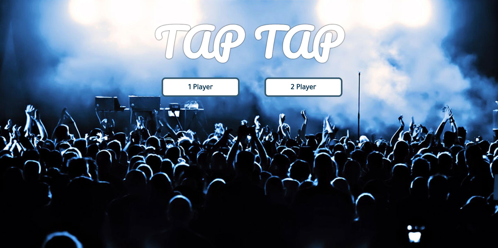
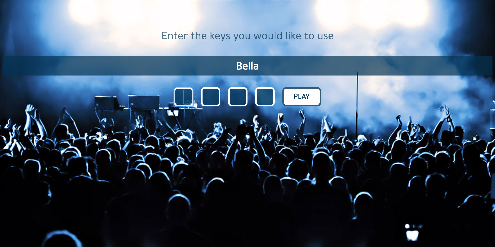

#  WDI 34 Project 1

## Tap Tap

Our first project was to create a game using vanilla Javascript and the jQuery Library. I created a similar styled game to 'Guitar Hero' and 'Tap Tap Revenge', with the aim of the game being to tap different keys in sync with when balls coming up the page come into contact with their targets at the top, all in time with music.

*Website and mobile version are both available, however go to the website for the best experience.*

#### Technologies Used
HTML | SCSS | JavaScript (ES6) | jQuery

[Play Here!](http://www.belladear.co.uk/project-1-wdi/)

***

### The Game

There are three stages before the game starts. First, you have a choice of 1 or 2 players. Next, you enter your name and then lastly, you choose your keys that you wish to play with.

 

As the balls overlap with their corresponding targets, the player has to press the key which they assigned to that target. The better the accuracy, the better the score.

When playing 2 player, the person with the highest score at the end of the song wins!

---
### In Review

I really enjoyed making this game and was pleased with
the outcome. I was really happy to achieve almost all of my ideas that I had when first starting to plan the game, which I didn't think were going to be achievable in the length of time we had.

#### Challenges

It was a challenge to keep the website running smoothly when there were so many balls being generated and calculations going on at the same time. I resolved this by having clean code and removing any elements that weren't on the page at any given time.

Initially I did one player then attempted two player. In hind sight I would have started with the intent to do two player. This would have meant my HTML structure and variable names would have been better and more clear. However I now feel I will be better at planning my projects in the future as I have more of an idea how to structure and order my elements and functions.

#### Further Additions
If I were to add further aspects to the game I would make 2 player available in mobile mode, as well as create more levels with different music. I would also set up a high score function where a record of previous high scores are stored and can be seen for new players to beat.
